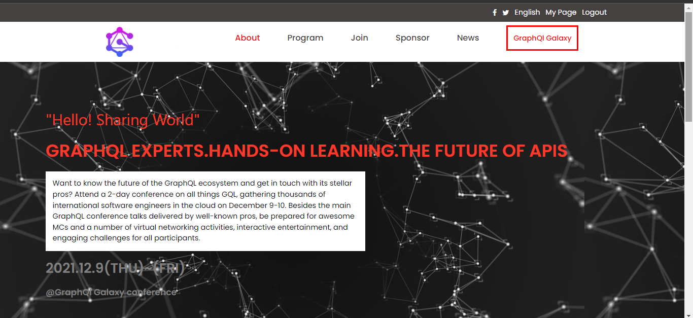
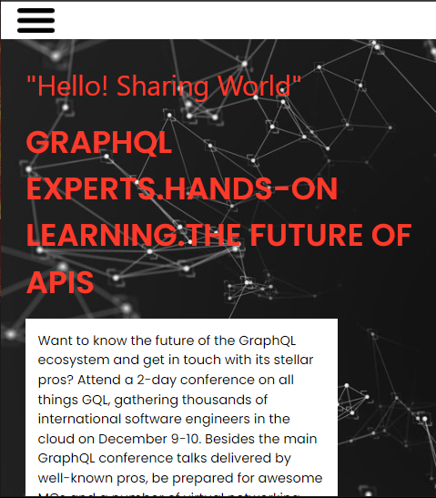

# web conference capstone

> This is a demo conference website project that serves the purpose of facilitating Graphql users , with an about page to give more information about the conference.

# desktop version

# mobile version

This is capstone project done after first module at microverse where you assess all contents of Module1

## Built With
- Html
- Css
- Javascript
- html&css&javascript linters
- git

## Live Demo

[Live Demo Link](https://mugishasam123.github.io/first-capstone-project/)

[Video description](https://www.loom.com/share/b11c45f6965f498488c9e13ca1297abd)

## Getting Started

To get a local copy up and running follow these simple example steps.

-  go to your git terminal
- type git clone `https://github.com/mugishasam123/first-capstone-project.git`
- Run index.html in your web browser.

### Prerequisites

- git
-  vs code or your preferred
-  web browser

## Authors

👤 **Author1**

- GitHub: [@githubhandle](https://github.com/mugishasam123)
- Twitter: [@twitterhandle](https://twitter.com/mugishasamuel42/)
- LinkedIn: [LinkedIn](https://www.linkedin.com/in/mugisha-samuel-55a905208/)

## 🤝 Contributing

Contributions, issues, and feature requests are welcome!

Feel free to check the [issues page](../../issues/).

## Show your support

Give a ⭐️ if you like this project!

## Acknowledgments

- This design is similar to the one created by Cindy Shin .
- Microverse

## 📝 License

This project is [MIT](./MIT.md) licensed.
